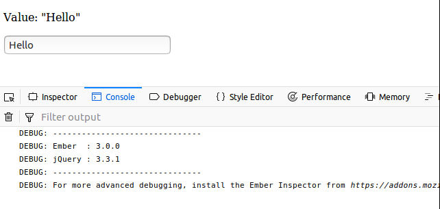
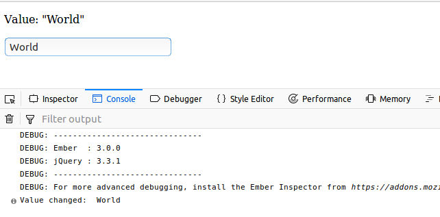
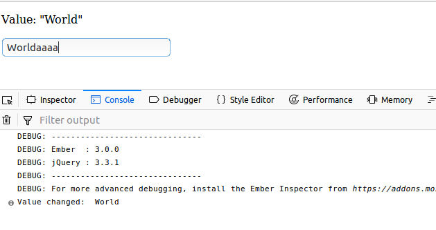

## Ember Dom value binding test

This project tries to test and demo a dom value binding coercion 
fail.

The project shows an input value that is bound to a computed value 
coerced to certain values. The coercion doesn't get reflected on the input
value after the first time

Start the app with 
> ember s

- Access the home page on http://localhost:4200

- Input a character on the input text

You get the correct value defined by the computed property.
No difference between ember state and dom state.

- Input another character

Ember doesn't detect the input as value change, and doesn't reflect 
the computed value on the dom 

Tested with 
- node v8.9.4 (npm v5.6.0)
- ember-cli@3.0.0

Prerequisites
> npm install -g ember-cli
